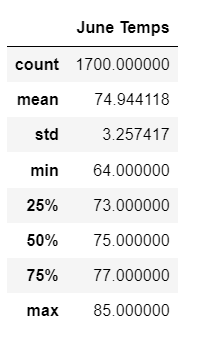
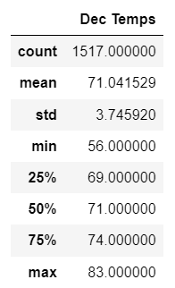

# Module 9 Challenge - surfs_up

## Overview of the Analysis

The objective of this analysis is to analyze and visualize climate data to prepare for the opening of a surf shop using Python, SQLAlchemy and Flask. Specifically, we want to analyze and compare the temperature data for the months of June and December in Oahu, in order to determine if the surf and ice cream shop business is sustainable year-round.

## Results

The following images shows us the temperature at Oahu in the month of June and December:

###Temperature at Oahu in the month of June

 
###Temperature at Oahu in the month of December

Following are the three key differences in the temperature in the month of June and December:-

- The average temperature at Oahu in the month of June is around 75 degrees where as average temperature in the month of December is around 71 degrees.

- The minimum temperature at Oahu in the month of June is 64 degrees where as the minimum temperature in the month of December is around 56 degrees.

- The maximum temperature at Oahu in the month of June is 85 degrees where as the maximum temperature in the month of December is around 83 degrees. 

## Summary 

As the weather in the month of June and December look quite similar except that minimum temperature lower down to 56 degrees in December as compared to 64 degrees in June, I think overall the data is favorable for opening the surf and ice-cream shop year round.

Additional queries that can be performed to gather more weather data for June and December:

1) We can perform precipation analysis for both the months for comparision purposes.
2) We can also perform station wise analysis so that we  have enough data collection stations for this information to be valid to figure out which stations tend to have the most precipitation recordings.